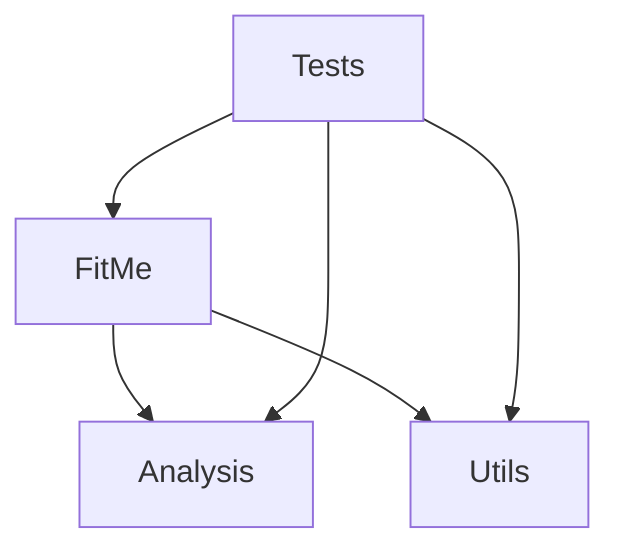
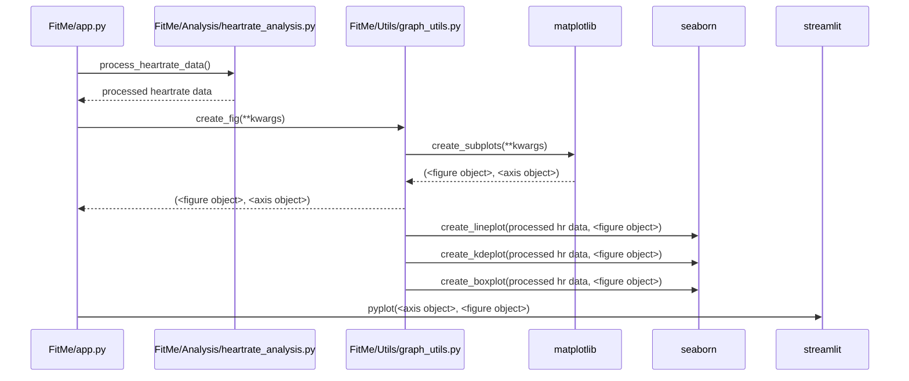

## Component List
1. CSV File
2. Upload Portal (frontend)
3. Insights Portal (frontend)
4. Data Preprocessing Script (backend)
5. Data Analysis Script (backend)

## High-level software architecture
FitMe software is bundled in 2 main Python module. Below is a high-level overview of the packages dependencies as well as what they contain:

- **FitMe** module (root module): contains the `app.py` file which contains the main application `streamlit` dashboard. This module uses the `analysis` module which contains the data processing/cleaning logic implementation. It also uses some utility functions contained within the `utils` mdodule.

- **Utils** module: contains utility functions for graphs visualization as well as UI items. 

- **Analysis** module (under `analysis/` directory) contains the data processing logic to process raw csv data and extract relevant information. This is called by the main `FitMe` module on raw data to get the processed dataframes to display through graphs.

- **Test** module (under `tests/` directory) contains unit tests file for the analysis module 

Below is a small overview of the different python module dependencies. 

### Relevant function definition examples
Below is a few use cases for function within the `FitMe` and `analysis` module.

#### FitMe module: `app.py`
Contains the main app loop to render the different graphs based on the selected dropdown value from Streamlit. Users can modify this file in order to add new graphs to be generated. 
- Reads the CSV raw data format, calls the data processing functions from the relevant `analysis` module and displays graphs using the `utils` module.

#### Utils: `graph-utils.py`
Contains various graphing utility function and acts as a wrapper around `seaborn` and `matplotlib`. This is especially useful for testing and mocking the different calls to external API. Also provides a single entry-point to any graph viz and removes the hard-coupling between our app and graphing libraries. 

#### Analysis module: `analysis/heartrate_analysis.py:process_heartrate_data(df_heartrate, df_daily_sleep, user_id):`
Contains data processing logic for heartrate analysis. 
- Given the raw DataFrame from the `heartrate_seconds_merged.csv` dataset and the `sleepDay_merged.csv` dataset, it will compute the daily average BPM and extract whether the users total sleep falls within a `['Less', 'Okay', 'Enough', 'Healthy']`  bucket. 

#### `analysis/sleep_analysis.py:process_sleep_analysis_data(df_sleep_data, user_id):`
Contains data processing logic for sleep analysis,
- Given the raw DataFrame from the `sleepDay_merged.csv` dataset, it will clean the date column to be properly displayed within the graph in `app.py`

## Sample sequence diagram
Below is a sample sequence diagram for the heartrate analysis to display the different graph and renders it to the streamlit UI. The flow is virtually the same for the other analyses.

